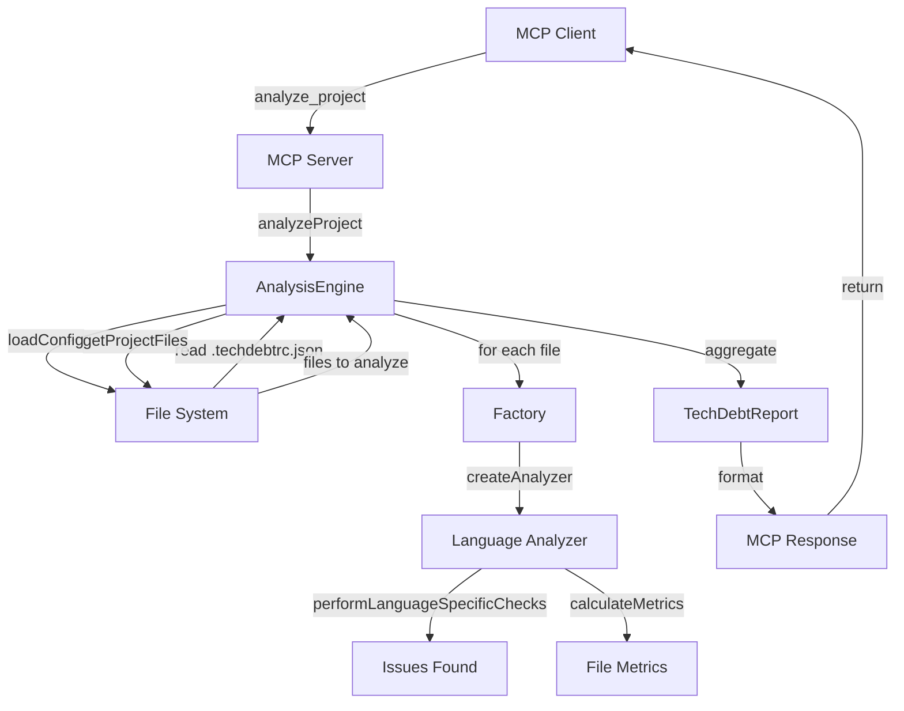
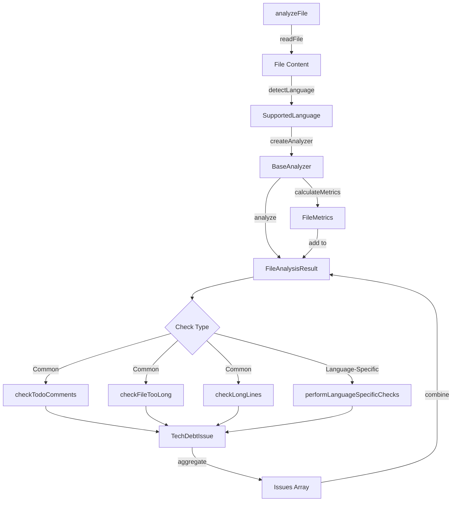
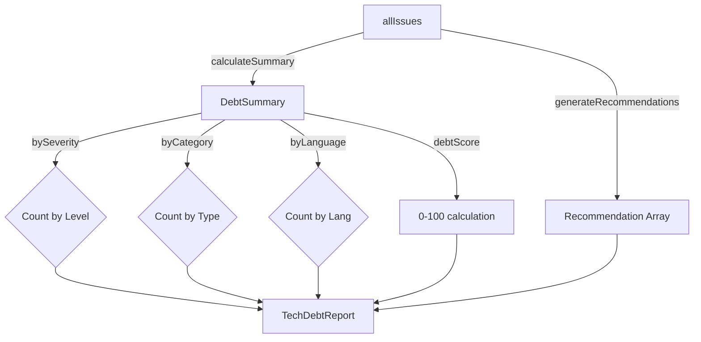

# Architecture - Tech Debt MCP

This document describes the architecture, design patterns, and data flow of the Tech Debt MCP server.

## Table of Contents

- [Overview](#overview)
- [Project Structure](#project-structure)
- [Design Patterns](#design-patterns)
- [Data Flow](#data-flow)
- [Core Components](#core-components)
- [Extending the System](#extending-the-system)

## Overview

Tech Debt MCP is a Model Context Protocol server that analyzes technical debt across multiple programming languages. It follows a modular, plugin-based architecture that makes it easy to add new language analyzers and analysis capabilities.

### Key Principles

1. **Single Responsibility** — Each module has one clear purpose
2. **Factory Pattern** — Create analyzers and parsers dynamically based on language/file type
3. **Base Class Inheritance** — Share common logic through abstract base classes
4. **Configuration-Driven** — Centralize rules and thresholds in configuration files
5. **Types First** — Single source of truth for all TypeScript interfaces
6. **Offline-First** — No external API calls by default; online features are opt-in

## Project Structure

```
TechDebtMCP/
├── src/
│   ├── index.ts                 # MCP Server entry point and tool handlers
│   ├── types/
│   │   └── index.ts             # All TypeScript interfaces (single source of truth)
│   ├── config/
│   │   └── languages.ts         # Language definitions and configurations
│   ├── core/
│   │   ├── analysisEngine.ts    # Main orchestrator for analysis
│   │   ├── sqaleEngine.ts       # SQALE metrics calculations (Phase 1)
│   │   ├── snapshotManager.ts   # Snapshot & trend tracking (Phase 3)
│   │   └── complexityAnalyzer.ts # Code complexity calculations (Phase 4)
│   ├── analyzers/
│   │   ├── baseAnalyzer.ts      # Abstract base class for all language analyzers
│   │   ├── index.ts             # Analyzer factory
│   │   ├── [language]Analyzer.ts # Language-specific analyzers (10 files)
│   │   └── dependencies/        # Dependency parsers (Phase 2, future)
│   │       ├── baseParser.ts
│   │       └── [ecosystem]Parser.ts
│   ├── services/
│   │   └── vulnerabilityService.ts # External API integration (Phase 2b, future)
│   └── utils/
│       └── fileUtils.ts         # File system utilities
├── __tests__/                   # Test files alongside source
├── dist/                        # Compiled output
├── package.json
├── tsconfig.json
├── .github/copilot-instructions.md
├── CONTRIBUTING.md
└── ARCHITECTURE.md              # This file
```

## Design Patterns

### 1. Factory Pattern

Used to create appropriate analyzer or parser instances based on language or file type.

```
Client
  ↓
createAnalyzer(language) → Switch statement
  ├→ 'typescript' → new TypeScriptAnalyzer()
  ├→ 'python'     → new PythonAnalyzer()
  └→ 'java'       → new JavaAnalyzer()
```

**Files involved:**
- `src/analyzers/index.ts` — `createAnalyzer()` factory
- `src/analyzers/dependencies/index.ts` — Dependency parser factory (future)

### 2. Abstract Base Class with Inheritance

All language analyzers extend `BaseAnalyzer` to share common logic while allowing language-specific implementations.

```
BaseAnalyzer (abstract)
  ├─ performLanguageSpecificChecks() [abstract, must override]
  ├─ checkTodoComments() [shared]
  ├─ checkFileTooLong() [shared]
  ├─ checkPattern() [helper]
  └─ calculateMetrics() [shared]
    ↓
TypeScriptAnalyzer
PythonAnalyzer
JavaAnalyzer
... (10 more)
```

**Files involved:**
- `src/analyzers/baseAnalyzer.ts` — Base class
- `src/analyzers/[language]Analyzer.ts` — Language-specific implementations

### 3. Configuration-Driven Design

Rules, thresholds, and language definitions are centralized in configuration files, not hardcoded.

```
src/config/languages.ts
  └─ LANGUAGE_CONFIGS: Record<SupportedLanguage, LanguageConfig>
       ├─ language name
       ├─ file extensions
       ├─ package files
       ├─ comment patterns
       ├─ TODO patterns
       └─ specific checks

.techdebtrc.json (user-provided)
  ├─ ignore patterns
  ├─ rule thresholds
  ├─ custom patterns
  └─ language overrides
```

## Data Flow

### High-Level Analysis Flow



### Analyzer Processing Flow



### Report Generation Flow



## Core Components

### 1. AnalysisEngine (`src/core/analysisEngine.ts`)

**Responsibility:** Orchestrates the entire analysis workflow.

**Key Methods:**
- `analyzeProject(options)` — Main entry point
- `calculateSummary(issues)` — Aggregate statistics
- `generateRecommendations(issues, summary)` — Create actionable suggestions
- `detectPackageManagers(packageFiles)` — Identify dependency managers

**Dependencies:**
- `BaseAnalyzer` (through factory)
- `fileUtils`
- `languages` config

### 2. BaseAnalyzer (`src/analyzers/baseAnalyzer.ts`)

**Responsibility:** Shared analysis logic for all languages.

**Key Methods:**
- `analyze(filePath, content)` — Main entry point
- `performLanguageSpecificChecks(filePath, content)` — [Abstract] Override in subclasses
- `checkTodoComments()` — Find TODO/FIXME/HACK comments
- `checkFileTooLong()` — Flag files exceeding line limits
- `checkPattern(filePath, content, regex, issue)` — Helper to match patterns
- `calculateMetrics(content)` — Compute file statistics

**Inheritance Chain:**
```
BaseAnalyzer (abstract)
    ↓
TypeScriptAnalyzer, PythonAnalyzer, JavaAnalyzer, ... (10 languages)
```

### 3. MCP Server (`src/index.ts`)

**Responsibility:** Expose analysis capabilities as MCP tools.

**Key Methods:**
- `setupHandlers()` — Register tool and resource handlers
- `handleAnalyzeProject()` — `analyze_project` tool
- `handleAnalyzeFile()` — `analyze_file` tool
- `handleGetDebtSummary()` — `get_debt_summary` tool
- `handleListSupportedLanguages()` — `list_supported_languages` tool
- `handleGetRecommendations()` — `get_recommendations` tool
- `handleGetIssuesBySeverity()` — `get_issues_by_severity` tool
- `handleGetIssuesByCategory()` — `get_issues_by_category` tool

**Future Tools (phases 1-6):**
- `get_sqale_metrics` (Phase 1)
- `check_dependencies` (Phase 2)
- `validate_config` (Phase 5)
- `save_baseline`, `compare_with_baseline`, `get_trend` (Phase 3)
- `get_complexity_report` (Phase 4)

### 4. Types (`src/types/index.ts`)

**Responsibility:** Single source of truth for all TypeScript interfaces.

**Key Interfaces:**
- `SupportedLanguage` — Union type of 14 languages
- `TechDebtIssue` — Individual issue found
- `FileAnalysisResult` — Result from analyzing one file
- `TechDebtReport` — Complete analysis report
- `DebtSummary` — Aggregated statistics
- `Recommendation` — Actionable suggestions
- `LanguageConfig` — Language definition
- `TechDebtConfig` — User configuration

## Extending the System

### Adding a New Language Analyzer

1. **Create the analyzer file:**
   ```typescript
   // src/analyzers/rustAnalyzer.ts
   export class RustAnalyzer extends BaseAnalyzer {
     constructor(config: TechDebtConfig = {}) {
       super('rust', config);
     }

     protected async performLanguageSpecificChecks(
       filePath: string,
       content: string
     ): Promise<TechDebtIssue[]> {
       const issues: TechDebtIssue[] = [];
       // Add Rust-specific checks
       issues.push(...this.checkPattern(filePath, content, /\.unwrap\(\)/g, {
         category: 'code-quality',
         severity: 'medium',
         title: 'unwrap() usage',
         description: 'Using unwrap() can panic at runtime',
         suggestion: 'Use error handling or Option::map instead',
         effort: 'small',
         rule: 'unwrap-usage',
         tags: ['error-handling'],
       }));
       return issues;
     }
   }
   ```

2. **Register in factory** (`src/analyzers/index.ts`):
   ```typescript
   case 'rust':
     return new RustAnalyzer(config);
   ```

3. **Ensure language config exists** (`src/config/languages.ts`):
   ```typescript
   rust: {
     name: 'Rust',
     extensions: ['.rs'],
     packageFiles: ['Cargo.toml'],
     commentPatterns: { /* ... */ },
     todoPatterns: [ /* ... */ ],
     specificChecks: [ /* ... */ ],
   }
   ```

4. **Add type** (`src/types/index.ts`):
   ```typescript
   export type SupportedLanguage = 
     | 'javascript' | 'typescript' | 'python' | /* ... */
     | 'rust'; // Add here
   ```

5. **Write tests** (`src/analyzers/__tests__/rustAnalyzer.test.ts`)

### Adding a New MCP Tool

1. **Add to tool list** (`src/index.ts`):
   ```typescript
   {
     name: 'my_new_tool',
     description: 'What it does',
     inputSchema: { /* ... */ },
   }
   ```

2. **Add handler case** (`src/index.ts`):
   ```typescript
   case 'my_new_tool':
     return await this.handleMyNewTool(args);
   ```

3. **Implement handler** (`src/index.ts`):
   ```typescript
   private async handleMyNewTool(args: Record<string, unknown>) {
     // Implementation
     return {
       content: [{ type: 'text', text: 'Result' }],
     };
   }
   ```

### Adding a New Core Engine

For major new functionality (like SQALE, dependency checking, trend tracking):

1. **Create engine file:** `src/core/[feature]Engine.ts`
2. **Export types:** Add to `src/types/index.ts`
3. **Integrate with AnalysisEngine:** Call from `analyzeProject()`
4. **Add MCP tool:** Expose via new tool in `src/index.ts`
5. **Write tests:** `src/core/__tests__/[feature]Engine.test.ts`

## Dependency Graph

```
index.ts (MCP Server)
  ├─ AnalysisEngine
  │   ├─ Analyzer (via factory)
  │   │   └─ BaseAnalyzer
  │   │       └─ languages.config
  │   └─ fileUtils
  ├─ languages.config
  └─ fileUtils

Future additions:
  ├─ SQALEEngine (Phase 1)
  ├─ DependencyAnalyzer (Phase 2)
  ├─ VulnerabilityService (Phase 2b)
  ├─ SnapshotManager (Phase 3)
  └─ ComplexityAnalyzer (Phase 4)
```

## Performance Considerations

1. **File Processing:** Analyzed in sequential order; can be parallelized in future
2. **Regex Patterns:** Compiled once in config; `.lastIndex` reset per line
3. **Memory:** Issues stored in memory; large projects may need pagination
4. **Configuration:** Loaded once per analysis; consider caching

## Future Enhancements

- **Parallel file processing** — Analyze multiple files concurrently
- **Incremental analysis** — Skip unchanged files
- **Plugin system** — Load analyzers dynamically
- **Custom severity weights** — User-configurable issue scoring
- **Integration with CI/CD** — GitHub Actions, GitLab CI, etc.

