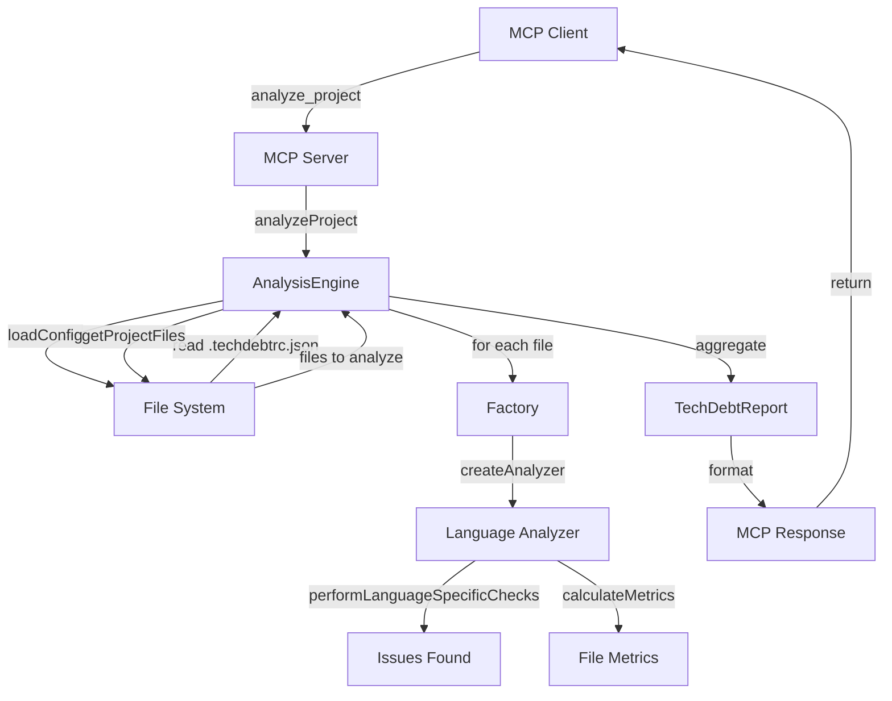
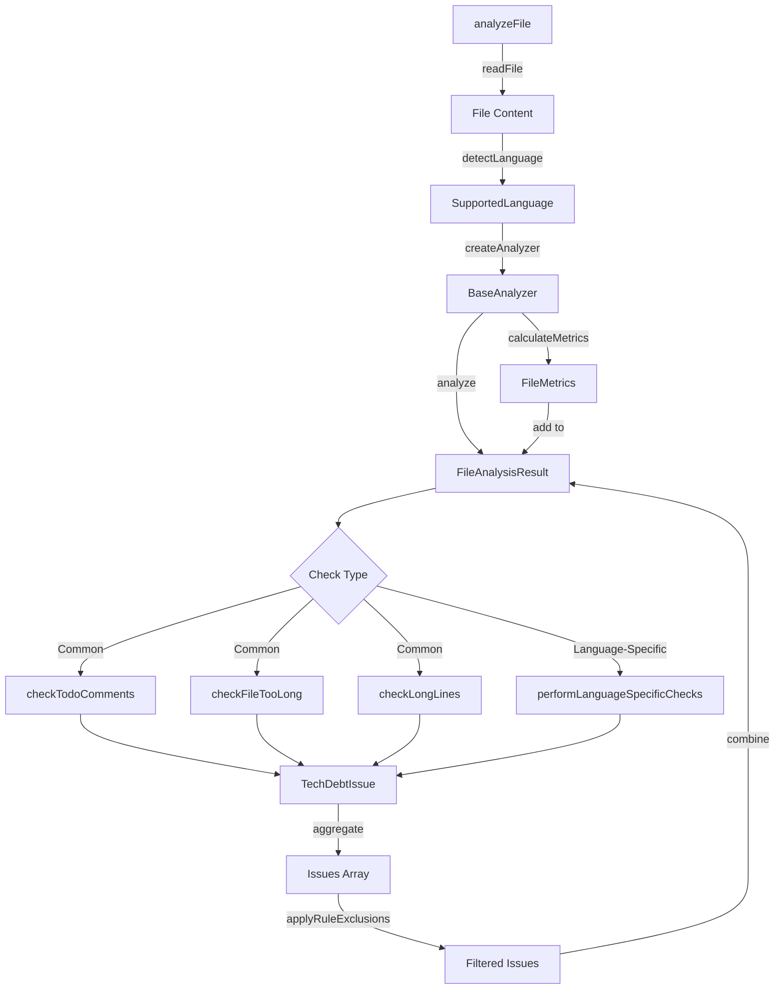
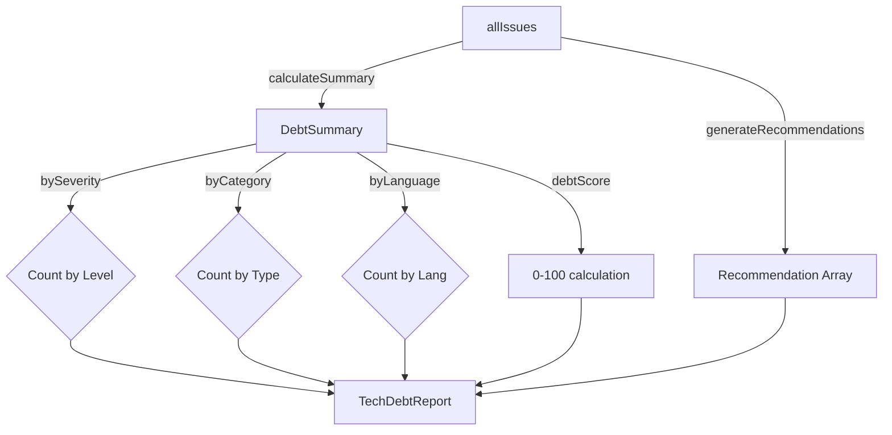

# Architecture - Tech Debt MCP

This document describes the architecture, design patterns, and data flow of the Tech Debt MCP server.

## Table of Contents

- [Overview](#overview)
- [Project Structure](#project-structure)
- [Design Patterns](#design-patterns)
- [Data Flow](#data-flow)
- [Core Components](#core-components)
- [Extending the System](#extending-the-system)
- [Dependency Graph](#dependency-graph)
- [Performance Considerations](#performance-considerations)
- [Future Enhancements](#future-enhancements)

## Overview

Tech Debt MCP is a Model Context Protocol server that analyzes technical debt across multiple programming languages. It follows a modular, plugin-based architecture that makes it easy to add new language analyzers and analysis capabilities.

### Key Principles

1. **Single Responsibility** — Each module has one clear purpose
2. **Factory Pattern** — Create analyzers and parsers dynamically based on language/file type
3. **Base Class Inheritance** — Share common logic through abstract base classes
4. **Configuration-Driven** — Centralize rules and thresholds in configuration files
5. **Types First** — Single source of truth for all TypeScript interfaces
6. **Offline-First** — No external API calls by default; online features are opt-in

## Project Structure

```
TechDebtMCP/
├── src/
│   ├── index.ts                 # Entry point — creates server, attaches handlers, runs
│   ├── server/
│   │   ├── setup.ts             # McpServer instantiation and transport wiring
│   │   ├── handlers.ts          # Core MCP tool request handlers & dispatch
│   │   ├── tools.ts             # Centralized TOOL_DEFINITIONS array
│   │   ├── inputParser.ts       # Tool argument validation (requireString, optionalString, optionalAbsolutePath, etc.)
│   │   ├── argValidation.ts     # Argument coercion and constraint checks
│   │   ├── formatters.ts        # Output formatting helpers
│   │   ├── configValidator.ts   # .techdebtrc.json validation handler
│   │   ├── dependencyHandlers.ts # Dependency analysis & vulnerability report handlers
│   │   ├── customRulesHandlers.ts # Custom rules management handlers (add, remove, list, execute, validate)
│   │   └── resourceHandlers.ts  # ✅ MCP resource templates (Phase 6 - COMPLETE)
│   ├── types/
│   │   └── index.ts             # All TypeScript interfaces (single source of truth)
│   ├── config/
│   │   └── languages.ts         # Language definitions and configurations
│   ├── core/
│   │   ├── analysisEngine.ts    # Main orchestrator for analysis
│   │   ├── sqaleEngine.ts       # ✅ SQALE metrics calculations (Phase 1 - COMPLETE)
│   │   └── customRulesEngine.ts # ✅ Custom rules engine (Phase 5 - COMPLETE)
│   ├── analyzers/
│   │   ├── baseAnalyzer.ts      # Abstract base class for all language analyzers
│   │   ├── index.ts             # Analyzer factory (createAnalyzer)
│   │   ├── [language]Analyzer.ts # 14 language-specific analyzers
│   │   ├── swiftUiChecks.ts     # SwiftUI Phase 1 checks (companion to swiftAnalyzer)
│   │   ├── swiftUiChecksPhase2.ts # SwiftUI Phase 2 checks (advanced patterns)
│   │   └── dependencies/        # ✅ Dependency parsers (Phase 2 - COMPLETE)
│   │       ├── baseParser.ts    # Abstract base parser
│   │       ├── index.ts         # Parser factory (createDependencyParser)
│   │       └── [ecosystem]Parser.ts # 10 ecosystem parsers
│   └── utils/
│       ├── fileUtils.ts         # File system utilities
│       └── regexUtils.ts        # escapeRegExp() — safe RegExp interpolation helper
├── dist/                        # Compiled output
├── package.json
├── tsconfig.json
├── .github/copilot-instructions.md
├── CONTRIBUTING.md
└── ARCHITECTURE.md              # This file
```

## Design Patterns

### 1. Factory Pattern

Used to create appropriate analyzer or parser instances based on language or file type.

```
Client
  ↓
createAnalyzer(language) → Switch statement
  ├→ 'typescript' → new TypeScriptAnalyzer()
  ├→ 'python'     → new PythonAnalyzer()
  └→ 'java'       → new JavaAnalyzer()
```

**Files involved:**
- `src/analyzers/index.ts` — `createAnalyzer()` factory
- `src/analyzers/dependencies/index.ts` — `createDependencyParser()` factory (10 ecosystems)

### 2. Abstract Base Class with Inheritance

All language analyzers extend `BaseAnalyzer` to share common logic while allowing language-specific implementations.

```
BaseAnalyzer (abstract)
  ├─ performLanguageSpecificChecks() [abstract, must override]
  ├─ checkTodoComments() [shared]
  ├─ checkFileTooLong() [shared]
  ├─ checkPattern() [helper]
  ├─ applyRuleExclusions() [filter by config globs]
  └─ calculateMetrics() [shared]
    ↓
TypeScriptAnalyzer
PythonAnalyzer
JavaAnalyzer
... (11 more)
```

**Files involved:**
- `src/analyzers/baseAnalyzer.ts` — Base class
- `src/analyzers/[language]Analyzer.ts` — Language-specific implementations

### 3. Configuration-Driven Design

Rules, thresholds, and language definitions are centralized in configuration files, not hardcoded.

```
src/config/languages.ts
  └─ LANGUAGE_CONFIGS: Record<SupportedLanguage, LanguageConfig>
       ├─ language name
       ├─ file extensions
       ├─ package files
       ├─ comment patterns
       ├─ TODO patterns
       └─ specific checks

.techdebtrc.json (user-provided)
  ├─ ignore patterns
  ├─ rule thresholds
  ├─ rule exclusions (per-rule file glob suppression)
  ├─ custom patterns
  └─ language overrides
```

## Data Flow

### High-Level Analysis Flow



### Analyzer Processing Flow



### Report Generation Flow



## Core Components

### 1. AnalysisEngine (`src/core/analysisEngine.ts`)

**Responsibility:** Orchestrates the entire analysis workflow.

**Key Methods:**
- `analyzeProject(options)` — Main entry point
- `calculateSummary(issues)` — Aggregate statistics
- `generateRecommendations(issues, summary)` — Create actionable suggestions
- `detectPackageManagers(packageFiles)` — Identify dependency managers

**Dependencies:**
- `BaseAnalyzer` (through factory)
- `fileUtils`
- `languages` config

### 2. BaseAnalyzer (`src/analyzers/baseAnalyzer.ts`)

**Responsibility:** Shared analysis logic for all languages.

**Supported Languages (14 total):**
- JavaScript, TypeScript, Python, Java, Swift, Kotlin
- Objective-C, C++, C, C#, Go, Rust, Ruby, PHP

Each language has a dedicated analyzer extending `BaseAnalyzer`.

**Key Methods:**
- `analyze(filePath, content)` — Main entry point
- `performLanguageSpecificChecks(filePath, content)` — [Abstract] Override in subclasses
- `checkTodoComments()` — Find TODO/FIXME/HACK comments
- `checkFileTooLong()` — Flag files exceeding line limits
- `checkPattern(filePath, content, regex, issue)` — Helper to match patterns (respects inline suppression)
- `isLineSuppressed(lines, lineIndex, rule, blockMap?)` — Check inline suppression directives
- `applyRuleExclusions(filePath, issues)` — Filter issues via `ruleExclusions` config globs (uses `minimatch`)
- `calculateMetrics(content)` — Compute file statistics

**Inheritance Chain:**
```
BaseAnalyzer (abstract)
    ↓
TypeScriptAnalyzer, PythonAnalyzer, JavaAnalyzer, ... (11 more)
```

### 3. MCP Server (`src/server/`)

**Responsibility:** Expose analysis capabilities as MCP tools and resources.

The server is split into focused modules under `src/server/`:

- **`setup.ts`** — McpServer instantiation and stdio transport wiring
- **`tools.ts`** — `TOOL_DEFINITIONS` array (16 tool schemas/descriptions)
- **`handlers.ts`** — `CallToolRequestSchema` switch dispatching to handler functions
- **`formatters.ts`** — Output formatting helpers
- **`configValidator.ts`** — `.techdebtrc.json` validation handler
- **`dependencyHandlers.ts`** — `check_dependencies` and `get_vulnerability_report` handlers
- **`resourceHandlers.ts`** — MCP resource templates (`debt://summary`, `debt://issues`)

**Entry point:** `src/index.ts` (18 lines) creates server, attaches handlers + resources, runs.

**Path sanitization convention (Issue #129):** All handler output that includes file or project paths must use `basename()` (from `node:path`) or `getRelativePath()` (from `fileUtils.ts`) — never embed raw absolute paths in MCP error messages or report fields. This applies to `dependencyHandlers.ts` (McpError messages, project-name fields) and `configValidator.ts` (all user-facing messages). Raw filesystem error messages (e.g., from `stat()` or `readFile()`) must also be sanitized before being surfaced to clients — either strip the absolute path from `err.message` or rethrow as a new `McpError` with a safe, basename-only message.

**16 MCP Tools:**
- Core: `analyze_project`, `analyze_file`, `get_debt_summary`, `list_supported_languages`, `get_recommendations`, `get_issues_by_severity`, `get_issues_by_category`, `get_sqale_metrics`
- Custom Rules (Phase 5): `add_custom_rule`, `remove_custom_rule`, `list_custom_rules`, `execute_custom_rules`, `validate_custom_pattern`
- Dependencies (Phase 2): `check_dependencies`, `validate_config`, `get_vulnerability_report`

**2 MCP Resources (Phase 6):**
- `debt://summary/{+projectPath}` — Health score, SQALE metrics, issue counts (`projectPath` must be an absolute filesystem path)
- `debt://issues/{+projectPath}` — Filterable issues list (severity, category, limit) (`projectPath` must be an absolute filesystem path)

**Future Tools:**
- `save_baseline`, `compare_with_baseline`, `get_trend`, `list_snapshots`, `delete_snapshot` (Phase 3)
- `get_complexity_report` (Phase 4)

### 4. Types (`src/types/index.ts`)

**Responsibility:** Single source of truth for all TypeScript interfaces.

**Key Interfaces:**
- `SupportedLanguage` — Union type of 14 languages
- `TechDebtIssue` — Individual issue found
- `FileAnalysisResult` — Result from analyzing one file
- `TechDebtReport` — Complete analysis report
- `DebtSummary` — Aggregated statistics
- `Recommendation` — Actionable suggestions
- `LanguageConfig` — Language definition
- `TechDebtConfig` — User configuration
- ✅ `SQALEMetrics` — SQALE technical debt metrics (Phase 1)
- ✅ `SQALERating` — A-E rating scale (Phase 1)
- ✅ `EffortTimeMapping` — Effort-to-time configuration (Phase 1)
- ✅ `CustomPattern` — Custom rule definition (Phase 5)

### 5. SQALEEngine (`src/core/sqaleEngine.ts`) ✅ COMPLETE

**Responsibility:** Calculate SQALE (Software Quality Assessment based on Lifecycle Expectations) metrics for quantifying technical debt.

**Key Methods:**
- `calculateMetrics(issues, developmentTime)` — Compute complete SQALE metrics
- `getRemediationTime(effort)` — Convert effort level to minutes
- `getRating(debtRatio)` — Calculate A-E rating from debt ratio
- `formatTime(minutes)` — Human-readable time formatting
- Private helpers for category/severity breakdowns

**SQALE Rating Scale:**
- A: ≤5% debt ratio (Excellent)
- B: 6-10% debt ratio (Good)
- C: 11-20% debt ratio (Fair)
- D: 21-50% debt ratio (Poor)
- E: >50% debt ratio (Critical)

**Metrics Provided:**
- Total remediation time (minutes)
- Formatted time (e.g., "2h 30m", "1d 4h")
- Debt ratio (percentage)
- SQALE rating (A-E)
- Breakdown by category
- Breakdown by severity

### 6. CustomRulesEngine (`src/core/customRulesEngine.ts`) ✅ COMPLETE

**Responsibility:** Allow users to define and execute custom pattern-based tech debt checks using regex.

**Key Methods:**
- `addRule(pattern)` — Add a custom rule
- `removeRule(ruleId)` — Remove a rule by ID
- `getRule(ruleId)` / `getAllRules()` — Retrieve rules
- `executeRules(filePath, content, language)` — Run all rules against code
- `getRuleStats()` — Get statistics by severity/category
- `static validatePattern(pattern)` — Validate rule before adding
- `static createSimplePattern()` — Helper to create patterns

**Features:**
- Regex pattern matching with configurable flags (allowlist: `dgimsuvy` — includes the `v` unicodeSets flag; `u` and `v` are mutually exclusive; patterns capped at 1,000 characters; inline `code` capped at 500,000 characters; `path` inputs capped at 500,000 bytes before reading). Node.js 20+ required as of v2.0.2.
- Language-specific rule filtering
- Multiple matches per line support
- Cross-platform line ending support (\r\n and \n)
- Column information for precise issue location
- Error callback for better testability
- Category and severity validation

**Pattern Execution Flow:**
```
CustomPattern
  ↓
validatePattern() [static]
  ↓
addRule()
  ↓
executeRules(filePath, content, language)
  ├─ Filter by language (if specified)
  ├─ Split content by lines (/\r?\n/)
  ├─ For each line:
  │   ├─ Apply regex with exec loop
  │   ├─ Capture match index & column
  │   └─ Create TechDebtIssue
  └─ Return issues array
```

## Extending the System

### Adding a New Language Analyzer

1. **Create the analyzer file:**
   ```typescript
   // src/analyzers/rustAnalyzer.ts
   export class RustAnalyzer extends BaseAnalyzer {
     constructor(config: TechDebtConfig = {}) {
       super('rust', config);
     }

     protected async performLanguageSpecificChecks(
       filePath: string,
       content: string
     ): Promise<TechDebtIssue[]> {
       const issues: TechDebtIssue[] = [];
       // Add Rust-specific checks
       issues.push(...this.checkPattern(filePath, content, /\.unwrap\(\)/g, {
         category: 'code-quality',
         severity: 'medium',
         title: 'unwrap() usage',
         description: 'Using unwrap() can panic at runtime',
         suggestion: 'Use error handling or Option::map instead',
         effort: 'small',
         rule: 'unwrap-usage',
         tags: ['error-handling'],
       }));
       return issues;
     }
   }
   ```

2. **Register in factory** (`src/analyzers/index.ts`):
   ```typescript
   case 'rust':
     return new RustAnalyzer(config);
   ```

3. **Ensure language config exists** (`src/config/languages.ts`):
   ```typescript
   rust: {
     name: 'Rust',
     extensions: ['.rs'],
     packageFiles: ['Cargo.toml'],
     commentPatterns: { /* ... */ },
     todoPatterns: [ /* ... */ ],
     specificChecks: [ /* ... */ ],
   }
   ```

4. **Add type** (`src/types/index.ts`):
   ```typescript
   export type SupportedLanguage = 
     | 'javascript' | 'typescript' | 'python' | /* ... */
     | 'rust'; // Add here
   ```

5. **Write tests** (`src/analyzers/__tests__/rustAnalyzer.test.ts`)

### Adding a New MCP Tool

1. **Add tool schema** (`src/server/tools.ts`):
   ```typescript
   {
     name: 'my_new_tool',
     description: 'What it does',
     inputSchema: { /* ... */ },
   }
   ```

2. **Add handler case** (`src/server/handlers.ts`):
   ```typescript
   case 'my_new_tool':
     return await handleMyNewTool(args);
   ```

3. **Implement handler** — in `handlers.ts` for core tools, or in a dedicated file (e.g., `configValidator.ts`, `dependencyHandlers.ts`) for domain-specific tools. Keep `handlers.ts` under 500 lines.

### Adding a New Core Engine

For major new functionality (like SQALE, dependency checking, trend tracking):

1. **Create engine file:** `src/core/[feature]Engine.ts`
2. **Export types:** Add to `src/types/index.ts`
3. **Integrate with AnalysisEngine:** Call from `analyzeProject()`
4. **Add MCP tool:** Schema in `src/server/tools.ts`, handler in `src/server/handlers.ts` (or dedicated file)
5. **Write tests:** `src/core/__tests__/[feature]Engine.test.ts`

## Dependency Graph

```
index.ts (Entry point)
  ├─ server/setup.ts (McpServer + transport)
  ├─ server/handlers.ts (tool dispatch)
  │   ├─ AnalysisEngine
  │   │   ├─ Analyzer (via factory)
  │   │   │   └─ BaseAnalyzer → src/config/languages.ts
  │   │   ├─ fileUtils
  │   │   └─ regexUtils (escapeRegExp)
  │   ├─ ✅ SQALEEngine (Phase 1)
  │   ├─ ✅ CustomRulesEngine (Phase 5)
  │   ├─ ✅ configValidator.ts (Phase 2)
  │   └─ ✅ dependencyHandlers.ts (Phase 2)
  │       └─ DependencyParsers (10 ecosystems, via factory)
  └─ server/resourceHandlers.ts (Phase 6)
      └─ AnalysisEngine (passive data access)

Future additions:
  ├─ SnapshotManager (Phase 3)
  └─ ComplexityAnalyzer (Phase 4)
```

## Performance Considerations

1. **File Processing:** Analyzed in sequential order; can be parallelized in future
2. **Regex Patterns:** Compiled once in config; `.lastIndex` reset per line
3. **Memory:** Issues stored in memory; large projects may need pagination
4. **Configuration:** Loaded once per analysis; consider caching

## SwiftUI Analysis Architecture

**Version Added:** v1.1.0  
**Module:** `SwiftAnalyzer` (extends `BaseAnalyzer`)  
**Implementation:** Issue #58

### Overview

The SwiftUI analyzer provides **14 specialized checks** for SwiftUI applications across 2 phases:
- **Phase 1:** Core SwiftUI checks (9 patterns)
- **Phase 2:** Advanced SwiftUI patterns (5 patterns)

### Implementation Pattern

All SwiftUI checks follow a consistent architecture:

```typescript
private checkSwiftUIPattern(filePath: string, lines: string[]): TechDebtIssue[] {
  const issues: TechDebtIssue[] = [];
  
  for (let i = 0; i < lines.length; i++) {
    const line = lines[i];
    // Pattern detection logic
    if (/* pattern detected */) {
      issues.push({
        id: `pattern-name-${filePath}-${i + 1}`,  // Globally unique ID
        category: 'code-quality',
        severity: 'medium',
        file: filePath,
        line: i + 1,
        title: 'Issue title',
        description: 'What the issue is',
        suggestion: 'How to fix it',
        effort: 'small',
        language: 'swift',
        rule: 'swiftui-pattern-name',
        tags: ['swiftui', 'specific-tag'],
      });
    }
  }
  
  return issues;
}
```

### Performance Optimization

**Content Splitting:** Pre-split once in `performLanguageSpecificChecks`:
```typescript
const lines = content.split('\n');
issues.push(...this.checkExcessiveStateVariables(filePath, lines));
issues.push(...this.checkStateObjectMisuse(filePath, lines));
// ... all other checks receive pre-split lines
```

This reduces overhead from O(N × checks) to O(1) for content splitting.

### Phase 1: Core SwiftUI Checks (9 Patterns)

| Check | Rule | Severity | Detection Method |
|-------|------|----------|------------------|
| Excessive @State | `swiftui-excessive-state` | Medium | Per-view @State counting with struct scope tracking |
| @ObservedObject Misuse | `swiftui-state-object-misuse` | High | Pattern: `@ObservedObject` + `= ` on same line |
| Environment Validation | `swiftui-env-validation` | High | Force unwrap detection at @Environment usage sites |
| Combine Circular Refs | `swiftui-combine-circular-ref` | High | `.sink` without `[weak self]` in context |
| Missing Timer Cleanup | `swiftui-timer-cleanup` | Medium | `Timer.scheduledTimer` without `onDisappear` |
| Missing Task Cancel | `swiftui-task-cancellation` | Medium | `Task {` without tracking or `.task` modifier |
| Main Thread Safety | `swiftui-main-thread-safety` | High | `Task {` + `self.` without `DispatchQueue.main` |
| Missing .id() | `swiftui-missing-id` | Medium | `ForEach` + dynamic data without `.id()` |
| Expensive Calculations | `swiftui-expensive-calculation` | Medium | `reduce/sort/filter` in view body |

### Phase 2: Advanced Patterns (5 Patterns)

| Check | Rule | Severity | Detection Method |
|-------|------|----------|------------------|
| AnyView Misuse | `swiftui-anyview-misuse` | Medium | `AnyView(` detection (type erasure) |
| NavigationLink Issues | `swiftui-navigationlink-deprecated` | Medium | Deprecated NavigationLink patterns |
| GeometryReader Root | `swiftui-geometryreader-root` | Medium | GeometryReader at `var body:` level |
| Retain Cycles | `swiftui-retain-cycle-closure` | High | `.onChange/.onReceive` without `[weak self]` |
| Deep Nesting | `swiftui-deep-nesting` | Medium | Brace depth >6 in view body |

### Test Coverage

**Total Repository Tests:** 597 (576 passing + 21 todo across 29 suites)

**SwiftUI Analyzer Tests:**
- **Phase 1 Tests:** 21 implemented test cases
- **Phase 2 Tests:** 20 implemented test cases  
- **Phase 3 Tests:** 13 todo tests for future enhancements

**Test Pattern:**
```typescript
it('should detect SwiftUI pattern', async () => {
  const code = `/* sample Swift code */`;
  const result = await analyzer.analyze('test.swift', code);
  const issues = result.issues.filter(i => i.rule === 'swiftui-pattern-name');
  
  expect(issues.length).toBeGreaterThan(0);
  expect(issues[0].severity).toBe('medium');
});
```

### Heuristic Limitations

The SwiftUI analyzer uses line-based pattern matching with the following known limitations:

1. **Multi-line Constructs:** Complex multi-line SwiftUI code may not be detected
2. **Comment Filtering:** Inline comments are stripped but may affect detection
3. **Scope Tracking:** Brace-depth counting for view scope has edge cases
4. **False Positives:** Demo/example code may trigger warnings

**Recommended Improvements (Phase 3):**
- Full Swift AST parsing for accurate scope detection
- Context-aware pattern matching
- Enhanced comment/string literal filtering
- User-configurable thresholds

### Design Decisions

1. **Issue ID Format:** `${rule}-${filePath}-${lineNumber}` for global uniqueness
2. **Pre-split Lines:** Pass `string[]` instead of `content: string` for performance
3. **Per-View Counting:** Track @State count per struct, not file-wide
4. **Severity Levels:** Align with Apple's best practices (High = potential crash)

### Dependencies

```typescript
import { TechDebtIssue } from '../types/index.js';
import { BaseAnalyzer } from './baseAnalyzer.js';
```

**No External Dependencies:** Uses only Node.js built-ins (string/array manipulation)

## Code Quality Standards

### Project Health Metrics (Self-Scan)

**Current Status (v2.0.2, April 2026):**
- **SQALE Rating:** A ⭐⭐⭐⭐⭐ (Excellent)
- **Debt Score:** 5/100 (Target: <5%)
- **Health Score:** 95/100
- **Total Issues:** 13 (0 critical, 0 high, 6 medium, 7 low)
- **Remediation Time:** 14 hours

**Note:** Down from 118 issues / 42.4 health in the v2.0.1 baseline after v2.0.2 security hardening, `ruleExclusions` config, nesting refactors (PRs #113, #118, #131, #146), and custom-rules handler extraction (#145). Remaining debt is 5 nesting hotspots (4 in server / core modules + 1 in `eslint.config.mjs`), 7 type-assertion usages at system boundaries, and 1 non-null assertion.

> See [TECH_DEBT_SCAN.md](TECH_DEBT_SCAN.md) for complete analysis including before/after comparison.

### File Size & Complexity Limits

| Metric | Limit | Current Max | Status |
|--------|-------|-------------|--------|
| File length | 500 lines | 346 (`src/server/handlers.ts`) | ✅ Good (further reduced in v2.0.2 after custom-rules handler extraction) |
| Nesting depth | 4 levels | ≤4 (all files) | ✅ Good (csharpAnalyzer fixed in PR #113, engines in PR #118, cppParser fixed in #131) |
| Function length | 50 lines | Compliant | ✅ Good |
| Cyclomatic complexity | 10 | Compliant | ✅ Good |

**Note:** File count grew from 25 → 43 → 49 across Feb 2026 → March 2026 → April 2026 scans as more analyzers, dependency parsers, server modules, and the ESLint flat config were added across v2.0.0, v2.0.1, and v2.0.2.

### Known Technical Debt Items

#### High Priority (Address when touching these files)

1. ~~**`src/index.ts` (883 lines)** - Split into modules~~ ✅ **DONE** (v2.0.0) — now 18 lines, split into `src/server/` modules

2. ~~**`src/analyzers/csharpAnalyzer.ts:267`** - Deep nesting (14 levels)~~ ✅ **DONE** (PR #113) — refactored to ≤4 levels via helper methods and early returns

3. ~~**False positives in analyzers** (13 high-severity false positives)~~ ✅ **DONE** (v2.0.1+) — Two complementary mechanisms: (a) `ruleExclusions` config in `.techdebtrc.json` for file-level glob suppression; (b) inline suppression comments (`// techdebt-ignore-next-line [rule]` and `// techdebt-ignore-start/end [rule]`) for line- and block-level suppression directly in source code. Analyzer pattern definitions use block suppression to avoid self-detection. See `src/analyzers/baseAnalyzer.ts` `isLineSuppressed()` and `buildBlockSuppressionMap()`.

#### Medium Priority (Gradual improvement)

5. ~~**Deep nesting in multiple files:**~~
   - ~~`src/core/customRulesEngine.ts:129` - 7 levels~~ ✅ **DONE** (PR #118) — refactored to ≤4 levels via helper methods
   - ~~`src/core/customRulesEngine.ts:validatePattern` - 6 levels~~ ✅ **DONE** (#146) — extracted `validatePatternRegex` private helper
   - ~~`src/core/analysisEngine.ts:93` - 5 levels~~ ✅ **DONE** (PR #118) — refactored to ≤4 levels via early returns
   - ~~`src/analyzers/dependencies/cppParser.ts` - 5 levels in `parseVcpkgJson`~~ ✅ **DONE** (#131) — extracted `makeVcpkgDep()` helper and early-return guard

6. **Test file organization** - Previously had 9-level deep nesting
   - Now excluded from production analysis via `.techdebtrc.json`
   - Can still be improved for test maintainability

### Code Quality Enforcement

These rules are enforced via `.techdebtrc.json` and CI checks:

- ❌ **Forbidden in production code:**
  - `debugger` statements
  - `@ts-ignore` comments (use `@ts-expect-error` with explanation)
  - `console.log` statements (use proper logging or remove)
  
- ✅ **Required patterns:**
  - JSDoc on all public APIs
  - Early returns to reduce nesting
  - Optional chaining for nullable access
  - Helper functions for complex logic

### Self-Scan Strategy

**Prevent False Positives:**
- Test files are ignored (contain test patterns, not production issues)
- Analyzer files may reference keywords (e.g., "debugger" in pattern definitions)
- Configuration in `.techdebtrc.json` excludes test directories

**Configuration Impact (Measured, v2.0.2 April 2026):**
```bash
# v2.0.2 (April 2026, post security hardening + nesting refactors):
- 13 issues, 14 hours remediation
- 49 files analyzed (TypeScript + the eslint flat config)
- 0 high-severity issues

# v2.0.1 baseline (March 2026, wider scan scope):
- 118 issues, ~96 hours remediation
- 43 files analyzed
- 12 high-severity issues

# Original baseline (Feb 2026, pre-.techdebtrc.json):
- 101 issues, 70 hours remediation
- 33 files analyzed (including tests)
- 17 high-severity issues (includes test false positives)
```

**Regular Health Checks:**
```bash
# Run self-scan before major releases
npx tech-debt-mcp analyze_project --path=/path/to/TechDebtMCP

# Target metrics:
# - SQALE Rating: A (≤5% debt ratio)
# - Critical issues: 0
# - High issues: <10 (excluding analyzer patterns)
# - File length violations: 0
```

**See [TECH_DEBT_SCAN.md](TECH_DEBT_SCAN.md)** for complete before/after analysis and detailed findings.

## Future Enhancements

- **Parallel file processing** — Analyze multiple files concurrently
- **Incremental analysis** — Skip unchanged files
- **Plugin system** — Load analyzers dynamically
- **Custom severity weights** — User-configurable issue scoring
- **Integration with CI/CD** — GitHub Actions, GitLab CI, etc.

## Phase 2: Dependency Analysis (Added)

Phase 2 introduces a modular dependency parsing subsystem and a new MCP tool, `check_dependencies`.

Key points:

- Parsers are implemented under `src/analyzers/dependencies/` following the same factory + base class pattern as language analyzers.
- Each parser focuses on one ecosystem and exposes a common async `parse(filePath, content)` interface that returns `Promise<ParsedDependency[]>`.
- A `check_dependencies` MCP tool scans the repository for recognized package files, invokes these async parsers, and returns a human-readable markdown report with production vs development dependencies and any failed parse entries.
- The design is offline-first and describes extension points for future vulnerability scanning services (e.g., a dedicated vulnerability scanning module in a later phase) without adding an immediate implementation path.

**Files added in Phase 2:**
```
src/analyzers/dependencies/
  ├── baseParser.ts
  ├── index.ts (factory)
  ├── npmParser.ts
  ├── pipParser.ts
  ├── cargoParser.ts
  ├── goModParser.ts
  ├── gradleParser.ts
  ├── composerParser.ts
  ├── bundlerParser.ts
  ├── nugetParser.ts
  ├── cppParser.ts
  └── swiftPackageParser.ts
```

These modules follow the existing analyzer conventions and are covered by unit tests in `src/analyzers/dependencies/__tests__/`.
